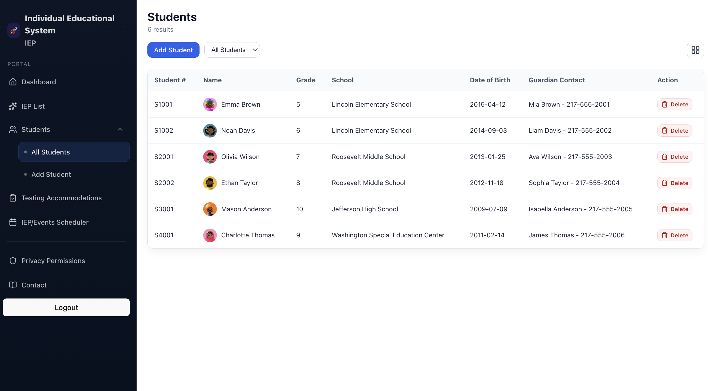

# IEP Management System

Full-stack prototype for managing students and IEP meetings/events.

- Frontend: React + Vite
- Backend: Express + PostgreSQL
- Auth: JWT
- Main flows: login, students CRUD, IEP/event scheduling calendar, IEP list

## UI Preview



## Features

- JWT login + `GET /api/auth/me`
- Student management with school auto-resolution/creation
- IEP/event management with:
  - `meeting_time` timestamp support
  - `meeting_link` support
  - event status (`draft`, `review`, `finalized`)
- Meeting calendar UI with:
  - month navigation (`Prev`, `Next`, `Today`)
  - add-event modal
  - tooltip event details
- Route helpers:
  - `/students/new` opens Add Student flow
  - `/ieps/new` redirects to Meeting page add-event modal

## AI-Powered Features (Planned Integration)

This prototype is designed to incorporate AI assistance for high-frequency IEP authoring tasks while keeping final decisions with educators.

### 1) Present Levels Summary Generator

- **Purpose:** Draft a present levels narrative (academic achievement + functional performance).
- **Inputs:** assessment scores, teacher observations, attendance/behavior notes (optional), recent progress updates.
- **Output:** editable text draft aligned to present-levels sections.
- **Human-in-the-loop:** case manager reviews and edits before saving.

### 2) Measurable Goal Generator

- **Purpose:** Produce draft annual goals from baseline data and identified needs.
- **Inputs:** area of need, baseline statement, target timeframe.
- **Output:** SMART-style goal options with suggested criteria and measurement method.
- **Human-in-the-loop:** educator selects, revises, and approves goal language.

### 3) Goal Quality Analyzer

- **Purpose:** Evaluate drafted goals for clarity and measurability.
- **Checks:** specificity, measurable criteria, realistic timeframe, baseline-target alignment.
- **Output:** quality score/flags plus concrete rewrite suggestions.
- **Human-in-the-loop:** recommendations are advisory only.

### 4) Accommodation Suggestion Assistant

- **Purpose:** Recommend accommodations linked to student needs and observed barriers.
- **Inputs:** present levels, disability-related needs, teacher notes, assessment patterns.
- **Output:** ranked accommodation suggestions with rationale and implementation notes.
- **Human-in-the-loop:** staff decides final accommodations.

### Suggested Workflow in This App

1. Import or enter student assessments/observations.
2. Generate present levels draft.
3. Generate measurable goals from present levels.
4. Run quality analyzer on selected goals.
5. Generate accommodation suggestions.
6. Save finalized content to IEP sections after staff review.

### Safety and Compliance Notes

- AI outputs are **draft assistance**, not automatic final decisions.
- Keep review/approval by authorized staff before publishing.
- Log generated content and edits for auditability.
- Avoid exposing sensitive data outside approved systems and policies.

## Project Structure

```text
.
├── backend/
│   ├── config/
│   ├── controllers/
│   ├── db/
│   ├── routes/
│   ├── script/
│   └── service.js
└── frontend/
    ├── src/app/
    ├── src/components/
    ├── src/pages/
    ├── src/services/
    └── src/styles/
```

## Prerequisites

- Node.js 18+
- PostgreSQL 14+ (local)
- `npm`

## Environment

Create `backend/.env`:

```env
PORT=5001
JWT_SECRET=replace-with-your-secret
DB_USER=your_db_user
DB_HOST=localhost
DB_NAME=iep_management
DB_PASSWORD=your_db_password
```

`DB_*` vars are optional in this codebase because backend has defaults, but setting them explicitly is recommended.

## Setup and Run

### 1) Install dependencies

```bash
cd backend && npm install
cd ../frontend && npm install
```

### 2) Initialize database schema

Run your schema setup (from `backend/db/initDB.js`) using your preferred method.

If your `ieps` table was created earlier and does not yet have `meeting_link`, run:

```sql
ALTER TABLE ieps ADD COLUMN IF NOT EXISTS meeting_link TEXT;
```

### 3) Seed demo data (optional but recommended)

```bash
cd backend
npm run data
```

### 4) Start backend

```bash
cd backend
npm run dev
```

Backend runs at `http://localhost:5001`.

### 5) Start frontend

```bash
cd frontend
npm run dev
```

Frontend runs at the Vite URL (typically `http://localhost:5173`).

## API Overview

Base URL: `http://localhost:5001/api`

### Auth

- `POST /auth/login`
- `POST /auth/logout`
- `GET /auth/me`

Example:

```bash
curl -X POST "http://localhost:5001/api/auth/login" \
  -H "Content-Type: application/json" \
  -d '{"email":"alice.johnson@school.org","password":"your-password"}'
```

### Students

- `GET /students`
- `GET /students/:id`
- `POST /students`
- `PATCH /students/:id`
- `DELETE /students/:id`

Create student example:

```bash
curl -X POST "http://localhost:5001/api/students" \
  -H "Content-Type: application/json" \
  -d '{
    "school_name":"Greenwood Elementary",
    "student_number":"S2345",
    "first_name":"Isabel",
    "last_name":"Chen",
    "grade_level":3
  }'
```

### IEPs / Events

- `GET /ieps` (supports optional `?studentId=...`)
- `GET /ieps/:id`
- `POST /ieps`
- `PATCH /ieps/:id`
- `POST /ieps/:id/status`

Create IEP/event example (current contract supports `student_name`):

```bash
curl -X POST "http://localhost:5001/api/ieps" \
  -H "Content-Type: application/json" \
  -d '{
    "student_name":"Isabel Chen",
    "meeting_time":"2026-03-05T14:30:00Z",
    "meeting_link":"https://zoom.us/j/123456789",
    "start_date":"2026-03-01",
    "end_date":"2027-03-01",
    "status":"draft"
  }'
```

Status transition example:

```bash
curl -X POST "http://localhost:5001/api/ieps/1/status" \
  -H "Content-Type: application/json" \
  -d '{"status":"review"}'
```

### Schools

- `GET /schools`

## Frontend Routes

- `/login`
- `/dashboard`
- `/students`
- `/students/new` (opens Add Student flow)
- `/meeting`
- `/ieps`
- `/ieps/new` (redirects to meeting add-event modal)
- `/privacy`

## Notes

- `meeting_time` is the canonical field for meeting date/time.
- `POST /api/ieps` can resolve `student_name` to an existing student, and will auto-create a basic student record if needed.
- `case_manager_user_id` is auto-resolved server-side when not provided.

## Health Check

```bash
curl "http://localhost:5001/health"
```

Expected:

```json
{ "status": "healthy", "database": "PostgreSQL" }
```